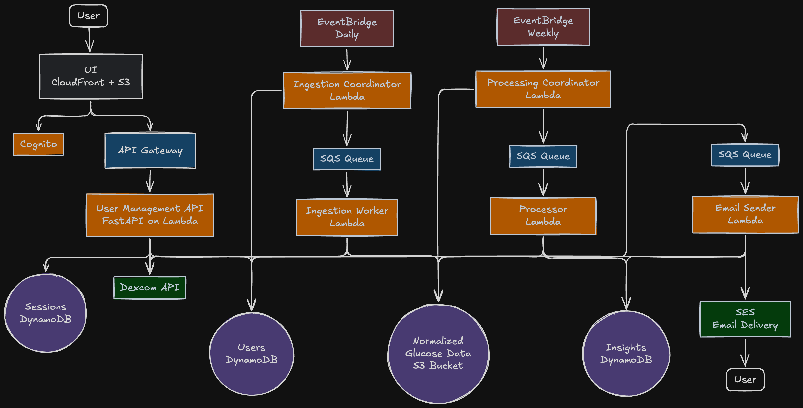

# Endo

A proactive type 1 diabetes assistant.

The average diabetic sees their endocrinologist only 1-2 times a year. Endo aims to fill that gap with periodic "nudges," using your recent glucose data to generate timely insights and actionable recommendations between doctor visits.

## Architecture

### Diagram

### Components
- **UI** (`ui/`) - React + TypeScript SPA with Cognito authentication
- **User Management API** (`user-management-api/`) - FastAPI backend with Dexcom OAuth
- **Data Ingestion** (`data-ingestion/`) - Daily scheduled job to fetch and normalize glucose data from providers (Dexcom, etc.) to S3
- **Data Processing** (`data-processing/`) - Weekly scheduled job to calculate insights and detect trends, stored in DynamoDB
- **Email Service** (`email-service/`) - Sends weekly emails via SES
- **Infrastructure** (`terraform/`) - All AWS resources (Lambda, S3, DynamoDB, Cognito, API Gateway, SQS, SES, etc.)

## Deployment

For detailed instructions, see [DEPLOYMENT.md](DEPLOYMENT.md).